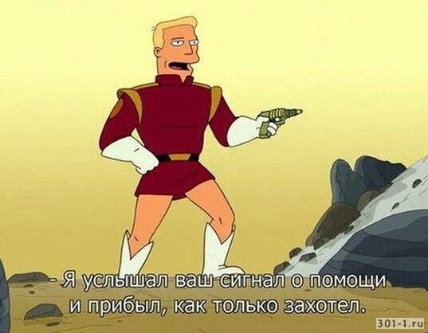

<!-- _class: lead -->
<!-- _paginate: false -->

# Лига "Беспилотник":
# Задачи, опыт участия и как меньше падать

#
#
#
#
#
#
#

##### Константин Володин

---
<!-- _class: diagram -->

---

# Немного о себе

## Володин Константин Игоревич

:snake: Python: люблю, применяю, преподаю

:robot::rocket: Разработчик встраиваемых систем

:sloth: Преподаватель САПР Altium Designer

:ru: Немного преподаю на кафедре ИТС ПензГТУ 
...

Чего точно не будет в презентации:
1. хардкорных расчетов и математики
2. газодинамики и Навье-стокса и т.п.

---

# План доклада

---

# Часть 1. Регламент, задачи, неожиданные открытия ~~(или как выглядит метка)~~

---

# Виды БЛА

https://www.youtube.com/watch?v=0aHXrUHTxP0

 

---

<!-- _class: invert2_2 -->
<!-- _paginate: false -->

# <!-- fit -->Как меньше падать?

---

<!-- _class: invert2_10 -->
<!-- _paginate: false -->
<!-- _backgroundColor: yellow -->

# <!-- fit -->Никак :)
Смирись и лучше проверяй _ВСЁ_ перед стартом 
---
# Часть 2. Опыт участия или Падать и падать - опыты ~~(работы с)~~ над студентами

---

<!-- _class: diagram -->

# Шел 2016 год ...

---

# <!-- fit --> Часть 3. ~~Вредные~~ Советы бывалых

---
# Защита превыше всего!

1. Наличие защиты участников от пропеллеров 
2. Химия может быть злой
3. Взорвавшиеся транзисторы - неплохие projectiles
4. Соблюдай полярность - разъемы с ключами

Примечание: дроны без пропеллеров не летают :)

---

# __Важность__ прецендентов

---
<!-- _backgroundColor: red -->
# Мультидисциплинарность

1. Курите кругозор: механика, электроника, программирование, физика

2. Основание по образованию от препода начинать, но добирать в команду противоположных людей 

---

# Инициативность важнее знаний

1. Обучение мотивированных == :heart:
2. Проще обучать чем объяснять зачем
3. Интенсивность работы в разы больше
4. :warning: Ответственность выгорания больше!

---

# __Важность__ потери/передачи контроля

1. Передайте контроль или его часть команде для повышения вовлеченности
2. Разбирайте неудачи

---

# __Необходимость__ потери контроля владения или __когнитивное искажение отчуждения__

<!--  -->

__Поймите и зафиксируйте:__
- все что летает - упадет --> не используйте негатив
- все что может сломаться - сломается (вопрос: когда?)
- все что могут сломать - сломают (вопрос: когда?)

__Нужна работа над ошибками !__

- после падения => разбор
- прорабатывайте вопросы халатности!
- поощеряйте инициативность в виде _принести свою изоленту )_

---

# Больше пропеллеров - лучше

---
# Больше пропеллеров - лучше (если кто не понял ;))

---
# С запасом брать все, на складе резерв

---
# Не стоит делать костыли, если есть готовое решение

__Пример:__ Ardupilot и полетник на Arduino, свой мотор и т.п.

__Есть исключение__: это ваша миссия или дополнительное исследование.

           

Источник изображения: https://oscarliang.com/arduino-nano-quadcopter-hardware-setting/

---
<!-- _class: diagram -->

# Контрите гайки

1. Как минимум протягивайте перед запуском
2. НЕ переусерствуте с фиксатором резьбы!
3. ДА, лучше применять синий
4. Синий == неизвлекаемость :)

Еще видео: https://www.youtube.com/watch?v=9E55qhFZYzI

---

# Разъемы 2РМТ и РС - крутые разъемы для крутых задач

&nbsp;
&nbsp; &nbsp; &nbsp;  &nbsp;&nbsp;&nbsp;&nbsp;&nbsp; 
&nbsp;
Источник:
https://zavod-elecon.ru/catalog/2rmt-2rmdt/ 
http://tdk-electro.ru/product/%D1%81%D0%BE%D0%B5%D0%B4%D0%B8%D0%BD%D0%B8%D1%82%D0%B5%D0%BB%D0%B8-%D1%80%D1%81-%D1%80%D1%81%D0%B3-%D1%80%D1%81%D0%B3%D1%81-%D1%80%D1%81%D0%B3%D1%81%D0%BF/

---

# Олег, придумай заголовок!

1. Agile: принципы
2. Инструменты работы команды программистов: GitLab (CI/CD), CMake, make, pyTest 
3. Graphana
4. Автоматизируй все!
5. Лучи от комплекта рамы - когда центр не торт

---
<!-- _backgroundColor: red -->
# Расписать предыдущий слайд

--- 

# Предложения

1. __Сертифицировать метку и систему сброса__

2. Сформулировать и отправить коллективное письмо с необходимостью прояснения вопросов по __2-й категории__: __метка__, __переносимый груз__.  

3. Внести предложение о __3-й категории в Лиге "Беспилотник"__
   __Идея__: участники разрабатывают прибор поиска очага возгарания
   __Почему?__: cоревноваться будут прибористы с прибористами
   Появится __ТЗ на прибор__ определения очага: ограничения по массе и габаритам, чертежи системы крепления, интерфейсы
   __Прибор__ перемещает по маршруту дрон организаторов

---

# Ссылки и материалы

1. Базовый репозиторий мероприятия: 
https://github.com/volodink/aes-uav-101/tree/dev

или QR-код

--- 

# Ссылки и материалы (продолжение)

2. Эту лекцию и файлы Python можно посмотреть [тут](https://drive.google.com/drive/folders/1w0w9rLx5d-pbX2hD0voHcD0BswQJEfVo?usp=sharing)

или QR-код

---
<!-- _class: contacts -->

# Контакты

 &nbsp; volodin.konstantin@gmail.com

  &nbsp; vk.com/volodin.konstantin

 &nbsp; @volodink

---

<!-- _class: oneline -->
<!-- _class: lead -->
<!-- _paginate: false -->

# Благодарю за внимание!

## Вопросы?

