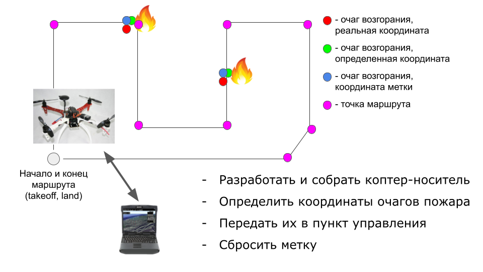
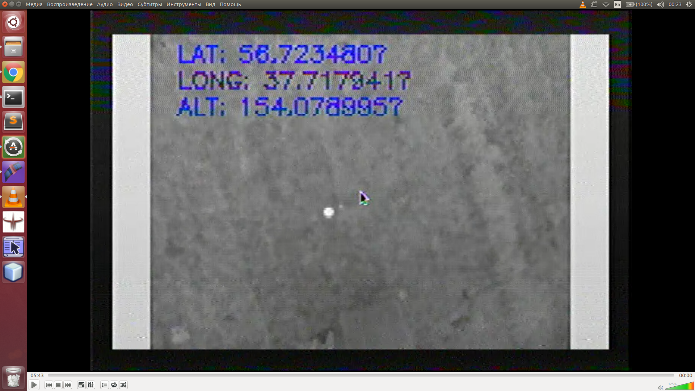

<!-- _class: lead -->
<!-- _paginate: false -->

# Лига "Беспилотник":

# Задачи, опыт участия и как меньше падать

#

#

#

#

#

#

#

##### Константин Володин

---

# Немного о себе

## Володин Константин Игоревич

:snake: Python: люблю, применяю, преподаю

:robot::rocket: Разработчик встраиваемых систем

:sloth: Преподаватель САПР Altium Designer

:ru: Немного преподаю на кафедре ИТС ПензГТУ
...

Чего точно не будет в презентации:

1. хардкорных расчетов и математики
2. газодинамики и Навье-стокса и т.п.

---

# План доклада

**Часть 1.** Регламент, задачи, неожиданные открытия ~~(или как выглядит метка)~~

**Часть 2.** Опыт участия или Падать и падать - опыты ~~(работы с)~~ над студентами

**Часть 3.** ~~Вредные~~ Советы бывалых

---

<!-- _class: lead -->

# Часть 1. Регламент, задачи, неожиданные открытия ~~(или как выглядит метка)~~

---

# Немного о регламенте

**Техническое задание** на **10-й чемпионат** == **другого пока нет**

---

# Немного о регламенте

---

<!-- _class: invert2_2 -->
<!-- _paginate: false -->

# <!-- fit -->Этого достаточно?

---

<!-- _class: invert3_10 -->
<!-- _paginate: false -->
<!-- _backgroundColor: yellow -->

# <!-- fit -->Нет :)

Изучай _ВСЁ_ что есть на сайте!

---

# А что еще?

**Положение** тоже имеет значение!

## Доступная информация на 10-й чемпионат 2020-2021 сезон

ЗАДАЧИ УЧАСТНИКОВ ПО ЛИГАМ

---

# А что еще?

**Информационное письмо** тоже имеет значение!

## Доступная информация на 11-й чемпионат 2021-2022 сезон

Структура чемпионата
В чемпионате 2021/2022гг. соревнования проводятся в следующих лигах:

---

# Вопросы после прочтения регламента или Что имели ввиду организаторы?

0. На чем и как летать?
1. Что такое метка?
2. Что такое система сброса?
3. Когда дадут точки полета?
4. Сколько точек?
5. Сколько меток?
6. Как решить задачу?
   ...

---

<!-- _class: diagram -->

# Виды беспилотных летательных аппаратов (БЛА)

 

 
Еще немного:
https://youtu.be/0aHXrUHTxP0?t=112

---

---
<!-- _paginate: false -->

---

# Промышленное применение

1. Инспекция: очаги пожара, ЛЭП, солнечные панели
2. Поиск людей
3. Пожаротушение

    

Источник: https://www.geekwire.com/2015/drone-helps-fight-washington-state-wildfires-in-latest-demonstration-of-the-technologys-potential/

---

<!-- _class: invert2_2 -->
<!-- _paginate: false -->

# <!-- fit -->Как меньше падать?

---

<!-- _class: invert2_10 -->
<!-- _paginate: false -->
<!-- _backgroundColor: yellow -->

# <!-- fit -->Никак :)

Смирись и лучше проверяй _ВСЁ_ перед стартом

---

<!-- _class: lead -->

# Часть 2. Опыт участия или Падать и падать - опыты ~~(работы с)~~ над студентами

---

<!-- _class: diagram -->

# Шел 2016 год ...

---

# Тепловизоры

Источник: What can I see with my thermal drone? | FLIR DELTA https://www.youtube.com/watch?v=CVE1HJ6n9g8

---

# Тепловизоры

---

<!-- _class: diagram -->
<!-- _paginate: true -->

# Основная идея

Источник: https://www.monochromeimaging.com/technical/full-spectrum-ir/

---

<!-- _class: diagram -->
<!-- _paginate: true -->

# Основная схема системы

---

<!-- _class: lead -->

# Ожидание VS Реальность

 

---

<!-- _class: diagram -->

# Моделирование и макетирование

---

<!-- _class: diagram -->

# Моделирование и макетирование

 

---

<!-- _class: diagram -->

# Конструирование и разработка электроники

 

---

---

---

---

<!-- _class: diagram -->

# Полетная часть: стабилизатор изображения

 

---

<!-- _class: diagram -->

# Наземная станция: трекер или задача: а где коптер?

---

---

<!-- _class: diagram -->

# Тесты поиска очага в кадре

---

<!-- _class: diagram -->

# Суровая реальность

  

  

---

---

<!-- _paginate: false -->

---

<!-- _paginate: false -->

---

<!-- _class: invert -->
<!-- _paginate: false -->

---

<!-- _class: invert -->
<!-- _paginate: false -->

---

<!-- _class: invert -->
<!-- _paginate: false -->

---

<!-- _class: invert -->
<!-- _paginate: false -->

---

---

<!-- _paginate: false -->

---

<!-- _paginate: false -->

---

<!-- _class: invert -->

# Улучшенный алгоритм распознавания и принятия решения

---

<!-- _class: invert -->

---

<!-- _class: invert -->

# Схема потоков приложения, реализующего алгоритм

---

<!-- _class: diagram -->

---

<!-- _paginate: false -->

---

<!-- _class: invert -->
<!-- _paginate: false -->

---

<!-- _class: invert -->
<!-- _paginate: false -->

---

<!-- _class: invert -->
<!-- _paginate: false -->

---

<!-- _class: invert -->
<!-- _paginate: false -->

---

<!-- _class: invert -->
<!-- _paginate: false -->

---

<!-- _class: invert -->
<!-- _paginate: false -->

---

<!-- _class: invert -->
<!-- _paginate: false -->

 &nbsp; &nbsp; 

---

<!-- _paginate: false -->

---

---

---

---

---

# Бортовой компьютер: Intel UP Core

 

Основные параметры:
Процессор: x5-z8350 (4C) 1,92GHZ, 4Гб ОЗУ, 64Гб ПЗУ, Intel HD 400, Требования по питанию: 5В 4А, Габаритные размеры, мм: 56,5\*66,0
Источник: https://up-board.org/upcore/specifications/

---

---

---

# Часть 3. ~~Вредные~~ Советы бывалых

---

# Защита превыше всего!

0. Пропеллеры!

- Отлаживайтесь БЕЗ пропеллеров!
- Снимайте пропеллеры при тестировании электроники!
- Транспортируйте модели БЕЗ пропеллеров!
- Наличие защиты участников от пропеллеров

1. Химия может быть злой
2. Взорвавшиеся транзисторы - неплохие projectiles
3. Соблюдай полярность - разъемы с ключами

Примечание: дроны без пропеллеров не летают :)

---

---

# Новые компоненты иногда реально новые

# Демонстрация веса и габаритов!!!

Весы: полетник, камеры, передатчик видео
Габариты: сервы

---

# **Важность** прецедентов

1. Про беспилотниик который потерялся и самоуничтожился почта России

2. Про позитив: Геоскан и синелифтер.
  

---

# Мультидисциплинарность

1. Расширяйте кругозор себе и участникам:

- физика
- механика
- электроника
- программирование

2. Начинать с базового образования руководителя

3. Добирать в команду противоположных по скиллам людей

---

# Инициативность важнее знаний

1. Обучение мотивированных == :heart:
2. Проще обучать чем объяснять зачем
3. Интенсивность работы в разы больше
4. :warning: Ответственность выгорания больше!

---

# **Важность** потери/передачи контроля

1. Передайте контроль или его часть команде для повышения вовлеченности
2. Разбирайте неудачи!
3. :heart: Самостоятельность, инициатива

---

# **Необходимость** потери контроля владения или **когнитивное искажение отчуждения**

<!--  -->

**Поймите и зафиксируйте:**

- все что летает - упадет --> не используйте негатив
- все что может сломаться - сломается (вопрос: когда?)
- все что могут сломать - сломают (вопрос: когда?)

**Нужна работа над ошибками !**

- после падения => разбор
- прорабатывайте вопросы халатности!
- поощряйте инициативность в виде _принести свою изоленту )_

---
<!-- _class: diagram -->

# Больше пропеллеров - лучше

---

<!-- _class: diagram -->

# Больше пропеллеров - лучше (если кто не понял ;))

 

---

# Логистика проекта

1. Брать все с запасом
2. На складе закладывать/оставлять резерв

---

# Не стоит делать костыли, если есть готовое решение

**Пример:** Ardupilot и полетник на Arduino, свой мотор и т.п.

**Есть исключение**: это ваша миссия или дополнительное исследование.

Источник изображения: https://oscarliang.com/arduino-nano-quadcopter-hardware-setting/

---

# Не решенные задачи на коптерах

1. Cайд проекты помогают думать

2. Повышает готовность и показатели для преподавателя

3. Идельно участие в региональных сборах и конференциях

---

<!-- _class: diagram -->

# Контрите гайки

1. Как минимум протягивайте перед запуском
2. НЕ переусерствуте с фиксатором резьбы!
3. ДА, лучше применять синий
4. Синий == неизвлекаемость :)

Еще видео: https://www.youtube.com/watch?v=9E55qhFZYzI

---

# Разъемы 2РМТ и РС - крутые разъемы для крутых задач

&nbsp;
&nbsp; &nbsp; &nbsp;  &nbsp;&nbsp;&nbsp;&nbsp;&nbsp; 
&nbsp;
Источник:
https://zavod-elecon.ru/catalog/2rmt-2rmdt/
http://tdk-electro.ru/product/%D1%81%D0%BE%D0%B5%D0%B4%D0%B8%D0%BD%D0%B8%D1%82%D0%B5%D0%BB%D0%B8-%D1%80%D1%81-%D1%80%D1%81%D0%B3-%D1%80%D1%81%D0%B3%D1%81-%D1%80%D1%81%D0%B3%D1%81%D0%BF/

---

# Олег, придумай заголовок!

1. Agile: принципы
2. Инструменты работы команды программистов: GitLab (CI/CD), CMake, make, pyTest
3. Graphana
4. Автоматизируй все!
5. Документация: вы помните все, ага, но запишите)

---

# Agile: принципы

---

# Инструменты работы команды программистов:

# GitLab, CMake, make, pyTest

---

# Graphana

---

# Автоматизируй все!

# (CI/CD)

---

# Документация: вы помните все, ага, но запишите)

---

# Предложения

1. **Сертифицировать метку и систему сброса**

2. Сформулировать и отправить коллективное письмо с необходимостью прояснения вопросов по **2-й категории**: **метка**, **переносимый груз**.

3. Внести предложение о **3-й категории в Лиге "Беспилотник"**
   **Идея**: участники разрабатывают прибор поиска очага возгорания
   **Почему?**: cоревноваться будут прибористы с прибористами
   Появится **ТЗ на прибор** определения очага: ограничения по массе и габаритам, чертежи системы крепления, интерфейсы
   **Прибор** перемещает по маршруту дрон организаторов

---

# Что будет еще?

1. Мастер-класс по задаче обнаружения очага возгорания в кадре.
2. ...

---

# Ссылки и материалы

1. Базовый репозиторий мероприятия:
   https://github.com/volodink/aes-uav-101/tree/dev

или QR-код

---

# Ссылки и материалы (продолжение)

2. Эту лекцию и файлы Python можно посмотреть [тут](https://drive.google.com/drive/folders/1w0w9rLx5d-pbX2hD0voHcD0BswQJEfVo?usp=sharing)

или QR-код

---

<!-- _class: contacts -->

# Контакты

 &nbsp; volodin.konstantin@gmail.com

 &nbsp; vk.com/volodin.konstantin

 &nbsp; @volodink

---

<!-- _class: oneline -->
<!-- _class: lead -->
<!-- _paginate: false -->

# Благодарю за внимание!

## Вопросы?
