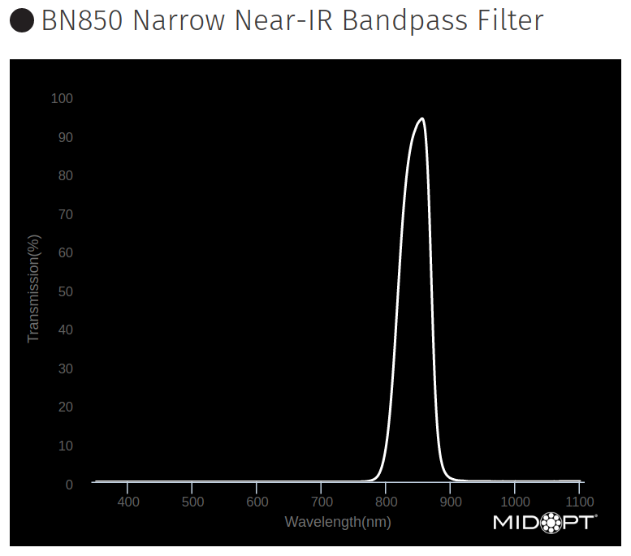
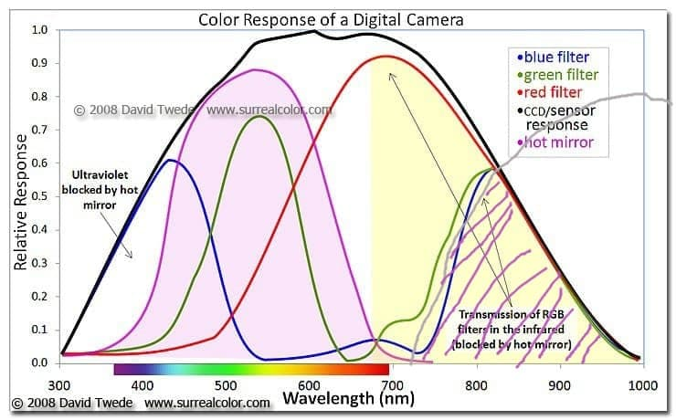

<!-- _class: lead -->
<!-- _paginate: false -->

# Лига Беспилотник: поиск очага возгорания
## Задачи и алгоритмы
### Константин Володин

---

<!-- _class: invert -->
<!-- _paginate: false -->
<!-- background: yellow -- >

# <!-- fit -->Ранее в сериале ...

---
<!-- _paginate: true -->

# Полосно-пропускающие оптические фильтры

Midopt bandpass filters

  

Источник: https://midopt.com/filters/bandpass/
BN850 filter: https://midopt.com/filters/bn850/

---
<!-- _class: diagram -->
<!-- _paginate: true -->

# Основная идея

Источник: https://www.monochromeimaging.com/technical/full-spectrum-ir/

---
<!-- _class: diagram_15 -->
<!-- _paginate: true -->

# Основная схема системы

---
<!-- _class: diagram -->
<!-- _paginate: true -->

# Конвейер обработки изображения с камеры

---

<!-- _class: invert -->
<!-- _paginate: false -->

# <!-- fit -->cессия live-coding

---

# Ссылки и материалы

1. Базовый репозиторий мероприятия: 
https://github.com/volodink/aes-uav-101/tree/dev

или QR-код

--- 

# Ссылки и материалы (продолжение)

2. Эту лекцию и файлы Python можно посмотреть [тут](https://drive.google.com/drive/folders/1w0w9rLx5d-pbX2hD0voHcD0BswQJEfVo?usp=sharing)

или QR-код

---
<!-- _class: contacts -->

# Контакты

 &nbsp; volodin.konstantin@gmail.com

  &nbsp; vk.com/volodin.konstantin

 &nbsp; @volodink

---

<!-- _class: oneline -->
<!-- _class: lead -->
<!-- _paginate: false -->

# Благодарю за внимание!

## Вопросы?

