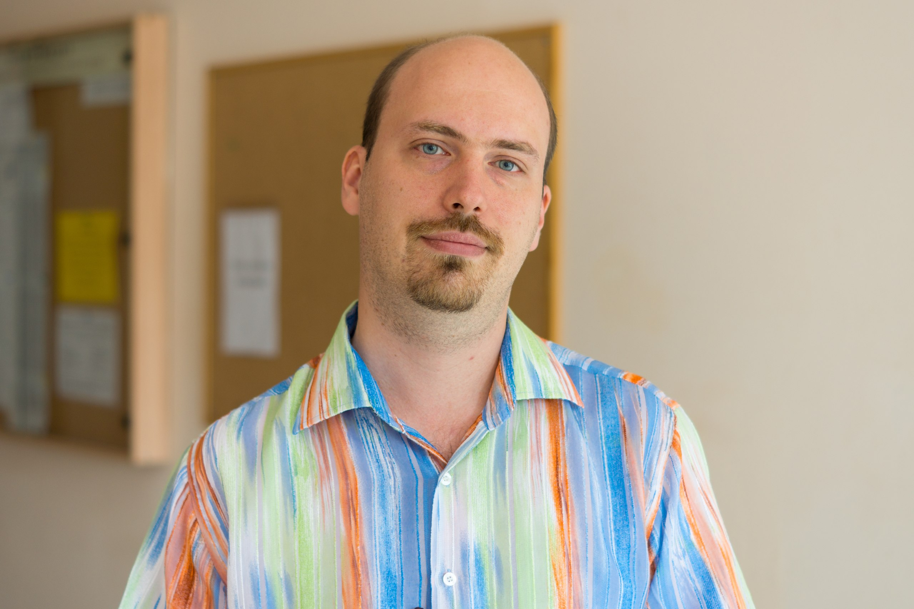
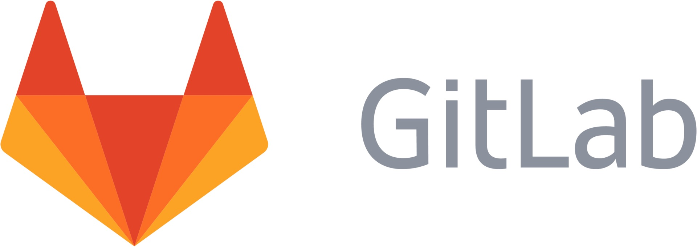

<!-- _class: lead -->
<!-- _paginate: false -->

# Platformio

## Введение

---

# О себе

## Володин Константин Игоревич

старший преподаватель

кафедра "Информационных технологий и систем" ПензГТУ

- Разработчик встраиваемых систем
- MTA, MCP Microsoft: Microsoft SQL Server
- Преподаватель САПР Altium Designer
- ...

---

<!-- _class: contacts -->

# Контакты

 volodin.konstantin@gmail.com

 vk.com/volodin.konstantin

 @volodink

---

<!-- _class: invert -->
<!-- _paginate: false -->

# <!-- fit -->TL;DR

---

# Виды активностей

1. Аудиторные

- Лекции
- Лабораторные

2. Внеаудиторные

- Самостоятельная работа (дз, подготовка контрольных и КР)\*
- Консультации по вопросам\*
- Семинары\*

_\*согласоввываются индивидуально_

---

# План работ

**1 семестр**

1. Лекции - 16 часов => 1 раз в неделю, 45 мин
2. Лаборные работы - 36 часов => 1 раз в неделю, 2\*45 мин
3. Контрольная работа

**2 семестр**

1. Лекции - 16 часов => 1 раз в неделю, 45 мин
2. Лаборные работы - 36 часов => 1 раз в неделю, 2\*45 мин
3. Контрольная работа
4. Курсовая работа

---

<!-- _class: oneline -->
<!-- _paginate: false -->

# <!-- fit -->Какой язык программирования?

---

<!-- _class: invert -->
<!-- _paginate: false -->

# <!-- fit -->Python

---

<!-- _paginate: false -->

---

<!-- _class: imagewall -->
<!-- _paginate: false -->

# Почему Python ?

   

  

---

# 1 семестр

**Базовые лекции (Basic):** _основы, общие понятия, Python basics_

1. Введение
2. Теория: алгоритмы и программы
3. Базовый ввод/вывод
4. if
5. for / while
6. list, slices, generators, str, tuple, dict, set
7. Файловый ввод/вывод
8. Функции, рекурсия, стек вызовов
9. Однострочники: немного функционального программирования в Python

---

# 1 семестр

**Контрольная работа** => семестровое задание

1. Сумма членов ряда последовательности
2. SAXPY
3. Умножение матриц
4. Решение системы линейных уравнений (Gauss-Jordan, Cramer)
5. _задание загружается ...._ \*

\*будет озвучено чуть позднее :thinking:

---

<!-- _class: manylines -->

# 2 семестр

**Продвинутые (Advanced):** _специальные и углубленные вопросы_

1. Сортировки: постановка задачи, пузырьковая
2. Сложность алгоритмов
3. Сортировки: быстрая, шелла, stdlibsort
4. Списки: структуры, очередь, стек, дек
5. Поиск на строках и в структурах
6. Алгоритмы на графах и деревьях
7. Интеграл методами прямоугольников, трапеций, Симпсона
8. Метод Монте-Карло
9. Простая скользящая средняя, простая экспоненциальная скользящая средняя, Медианый фильтр (SMM)
10. Базовые алгоритмы обработки изображений
11. Хеш-функции

---

# 2 семестр

**Лабораторные работы**

1. Сортировки
2. Поиск на строках
3. Поиск в структурах
4. Алгоритм Хаффмана
5. Алгоритмы на B-дереве
6. CRC, MD5

---

# 2 семестр

**Контрольная работа** => семестровое задание

1. Интеграл методами прямоугольников, трапеций, Симпсона
2. Метод Монте-Карло
3. Скользящая средняя и медианный фильтр

---

# Связь дисциплин

**Цель** => показать связь дисциплин междусобой

1. Математика
2. Физика
3. Теория информации
4. Основы защиты информации

---

# 2 семестр

**Курсовая работа** => целостный проект по ТЗ

1. Язык программирования: Python
2. Есть варианты - выбирает студент
3. Можно выбрать уровень освоения: 5, 4, 3
4. Выполняется в течении прохождения 2-го семестра
5. Защита курсовой работы с оценкой - лето 2021 года

---

# Информационные ресурсы: иностранные языки

1. Словарь английского/курсы
2. ~~Google translate~~
3. Мультитран: http://www.multitran.ru/c/m.exe?a=1&SHL=2

  

---

<!-- _class: manylines2 -->

# Информационные ресурсы: книги

1. Изучаем Python. Том 1 | Лутц Марк
2. Изучаем Python. Том 2 | Лутц Марк
3. Python. Карманный справочник | Лутц Марк
4. Изучаем Python. Программирование игр, визуализация данных, веб-приложения | Мэтиз Эрик
5. Автоматизация рутинных задач с помощью Python. Практическое руководство для начинающих

    

---

<!-- _class: manylines2 -->

# Информационные ресурсы: книги

1. Грокаем алгоритмы. Иллюстрированное пособие для программистов и любопытствующих | Бхаргава Адитья
2. Теоретический минимум по Computer Science. Все что нужно программисту и разработчику | Фило Владстон Феррейра
3. (2020)Алгоритмы. Теория и практическое применение / Essentials Algorithms: A Practical Approach to Computer Algorithms | Стивенс Род
4. Алгоритмы. Руководство по разработке | Стивен Скиена

   

---

# Информационные ресурсы: online-курсы

0. [Питонтьютор](https://pythontutor.ru/)
1. Coursera.org
2. EDX.org
3. [Stepik](https://welcome.stepik.org/ru)
4. [Национальный Открытый Университет «ИНТУИТ»](https://www.intuit.ru/)
5. ...
6. Profit!

---

# Информационные ресурсы: документация

1. Python - https://docs.python.org/3/

\*список в процессе дополнения

---

<!-- _class: linux -->

# Linux

 

---

# Virtual box

---

# Gitlab

Хранение кода и автоматизация: gitlab.com

---

# Лицензионное программное обеспечение

---

# Лицензионное программное обеспечение

1. Зарегистрироваться вот здесь
   
2. Прислать мне сообщение с данной почты и текстом:
   _Я студент группы ХХХ, ФИО, хочу лицензию JetBrains_
   (почта есть в контактах)

---

# Ссылки на ресурсы

1. Эта лекция: [тут](https://volodink.gitlab.io/aip/intro.pdf)
2. Репозиторий с лекциями: https://gitlab.com/volodink/aip
3. Материалы для 1 курса: [gdrive](https://drive.google.com/drive/folders/1S1n5g7gY_NuQXS1_422mQSkfa3eOzvK4)
4. Курс в Moodle: [тут]()

---

<!-- _class: oneline -->
<!-- _class: lead -->
<!-- _paginate: false -->

# Благодарю за внимание!

## Вопросы?

